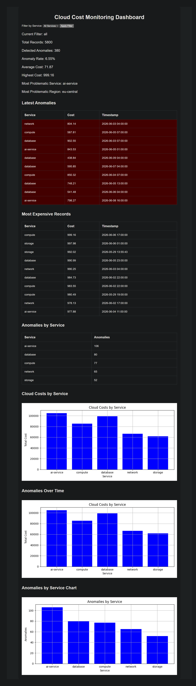

# Cloud Cost Monitoring Tool with AI Anomaly Detection

## Dashboard Preview



A learning project focused on building a cloud cost monitoring system with AI-based anomaly detection.

The goal of this project is to understand how to design, build, debug, and improve a real-world Python application using data analysis, machine learning, data visualization, and software engineering practices.

---

## Project Goal

The main purpose of this project is **learning by building**.

Instead of following tutorials only, the goal is to understand how individual technologies work together in a practical project:

* generating cloud cost data
* importing external datasets
* storing historical data
* analyzing trends
* visualizing cloud costs
* detecting anomalies using AI
* building dashboards
* improving code quality and project structure

This project is intentionally developed step by step to better understand how data-driven monitoring systems are designed and maintained.

---

## Current Features

### Data Generation

* Simulated cloud cost monitoring
* Monitoring intervals every 3 hours
* Multiple cloud services
* Multiple cloud regions
* Random anomaly simulation
* DEV / DEMO monitoring modes

### CSV Import

* Import cloud cost data from CSV files
* External dataset support
* AI anomaly detection on imported data

### Database

* SQLite database storage
* Historical data persistence
* AI anomaly status stored in database
* Optional database reset for testing

### Data Analysis

* Cost aggregation by service
* Average cost calculation
* Highest cost detection
* AI anomaly statistics
* Service-based anomaly analysis
* Region-based anomaly analysis

### Dashboard

* Flask-based web dashboard
* Real-time metrics overview
* Interactive service filtering
* Dashboard analytics

### Metrics

* Total Records
* Detected Anomalies
* Anomaly Rate
* Average Cost
* Highest Cost
* Most Problematic Service
* Most Problematic Region

### Tables

* Latest Anomalies
* Most Expensive Records
* Anomalies by Service

### Charts

* Cloud Costs by Service
* Anomalies Over Time
* Anomalies by Service

### AI / Machine Learning

* Anomaly detection using Isolation Forest
* Detection of unusual cloud spending patterns
* Statistical anomaly analysis
* Automatic anomaly labeling
* AI anomaly persistence in SQLite

---

## Technologies Used

### Backend

* Python
* Flask

### Database

* SQLite

### Data Analysis

* pandas
* NumPy

### Data Visualization

* matplotlib

### Machine Learning

* scikit-learn

### Version Control

* Git
* GitHub

---

## Project Structure

```text
cloud-cost-monitor/
│
├── database/
│   └── cloud_costs.db
│
├── data/
│   └── sample_cloud_costs.csv
│
├── static/
│   └── style.css
│
├── templates/
│   └── index.html
│
├── analysis.py
├── config.py
├── csv_import.py
├── dashboard.py
├── database.py
├── generator.py
├── main.py
├── requirements.txt
└── README.md
```

---

## Installation

### Clone Repository

```bash
git clone https://github.com/RPOstrava/Cloud-Cost-Monitoring-Tool-with-AI-Anomaly-Detection.git
cd Cloud-Cost-Monitoring-Tool-with-AI-Anomaly-Detection
```

### Install Dependencies

```bash
pip install -r requirements.txt
```

### Run Data Generator

```bash
python main.py
```

### Run Dashboard

```bash
python dashboard.py
```

Open your browser:

```text
http://localhost:5000
```

---

## Configuration

The project can be configured through `config.py`.

Available settings include:

* number of generated records
* CSV import mode
* anomaly detection sensitivity
* monitoring interval
* DEV / DEMO mode
* database reset options

---

## Learning Objectives

This project is intentionally developed incrementally.

The goal is not only to build a working application but also to understand:

* Python development
* debugging
* refactoring
* data analysis
* machine learning basics
* dashboard development
* database design
* Git workflow
* real software development processes

---

## Possible Future Improvements

* Region filtering
* CSV export functionality
* Additional dashboard metrics
* Improved UI styling
* Interactive charts
* Automated reporting
* Docker containerization
* Deployment experiments

---

## Project Status

### Functional Prototype Completed

Implemented features include:

* data generation
* CSV import
* SQLite storage
* AI anomaly detection
* Flask dashboard
* analytics and reporting
* service filtering
* anomaly visualization

This project continues as a learning platform for Python, data analysis, monitoring concepts, and AI-based anomaly detection.

---

## Author

Richard Ploskonka

GitHub: https://github.com/RPOstrava
